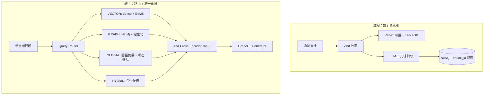

# 🧠 DynaSense-RAG（MAP-RAG 架構）

> **MAP-RAG**: Multi-resolution Agentic Perception Retrieval-Augmented Generation

企業級 RAG（檢索增強生成）架構原型，著重嚴格的反幻覺機制、智慧語意分塊與 Cross-Encoder 重排序。

## 🌐 其它語言
[English 🇺🇸](README.md) · [日本語 🇯🇵](README-jp.md) · [Deutsch 🇩🇪](README-de.md) · [简体中文](README-cn.md)

## 🎯 核心理念
**「沒有回答，好過錯誤／有害的回答。」**

在企業環境（法務、金融、內部人事政策）中，LLM 幻覺不可接受。本 MVP 在主流程上**明確拒絕**即時通用查詢改寫，以避免「意圖漂移」（專業內部術語被改寫成泛化用語、失去精確含義），並減少不必要的 LLM 延遲。

取而代之的是透過以下方式獲得高精度：
1. **智慧分塊**（Jina Segmenter）
2. **高維向量檢索**（Google Vertex AI `text-embedding-004` + LanceDB）
3. **Cross-Encoder 語意重排序**（Jina Multilingual Reranker）
4. **雙軌 Grader + Generator**（LangGraph 狀態機 — 事實型查詢嚴格、推理型查詢可分析）
5. **伺服器端多輪記憶**（含上下文長度控制的工作階段）
6. **Hybrid RAG（MVP）** — **Query Router** + **Dense + BM25** + **Neo4j 圖譜召回** + 進入打分前的統一 **Top‑K 重排**（見 `docs/mvp_hybrid_rag.md`）


## 🏗️ 架構設計（MAP-RAG）

```text
╔══════════════════════════════════════════════════════════════════════╗
║                     資料擷取管線                                       ║
╚══════════════════════════════════════════════════════════════════════╝

原始文件（TXT/MD）
      │
      ▼
[ Jina 語意切分器 ] ──(分塊)──> 子文字區塊
                                              │
                    ┌─────────────────────────┴──────────────────────────┐
                    ▼                                                    ▼
         [ 文件庫（MongoMock） ]                    [ Vertex AI Embeddings ]
           儲存：完整父文字                            text-embedding-004
           鍵：parent_id  ◄──── parent_id ────────────────────┤
                                                               ▼
                                                    [ 向量庫（LanceDB） ]
                                                      儲存：稠密向量
                                                      中繼資料：parent_id

╔══════════════════════════════════════════════════════════════════════╗
║               檢索與產生管線                                           ║
╚══════════════════════════════════════════════════════════════════════╝

  使用者查詢 ──────────────────────────────────┐
      │                                         │ （多輪）
      │                              [ 工作階段記憶 ]
      │                              conversation_id
      │                              歷史 → 上下文預算
      │                              _build_query_with_history()
      │                                         │
      ▼                                         ▼
[ LanceDB 向量檢索 ]  ←──── 含歷史的增強查詢
   Top K=10 子區塊
      │
      ▼
[ Small-to-Big 擴展 ]
   child_id → parent_id → 完整父文字
      │
      ▼
[ Jina Cross-Encoder 重排序 ]
   Top K=3 高精度父文件
      │
      ▼
[ 查詢類型偵測 ]   ← NEW: _is_analysis_query()
      │
      ├─────── 事實型查詢 ──────────────────────────────────┐
      │        （查閱、定義、具體事實）                      │
      │                                                        ▼
      │                                           [ GRADE_PROMPT（嚴格） ]
      │                                           「上下文是否包含
      │                                            可直接回答的事實？」
      │                                                        │
      │                                            否 ──► [ 攔截 / 備援 ]
      │                                            是 ──► [ GEN_PROMPT ]
      │                                                    「嚴格使用上下文。」
      │
      └─────── 分析型查詢 ────────────────────────────────┐
               （分析/影響/如何/為什麼/規劃/評估…）         │
               （analyze/impact/why/how/plan/risk…）         ▼
                                                 [ GRADE_ANALYSIS_PROMPT（寬鬆） ]
                                                 「上下文是否包含**任何**
                                                  與主題相關的背景事實？」
                                                              │
                                                  否 ──► [ 攔截 / 備援 ]
                                                  是 ──► [ GEN_ANALYSIS_PROMPT ]
                                                          「事實 grounding + 領域推理。
                                                           標註：
                                                           【文件事實】【分析推理】」
                                                              │
                                                              ▼
                                                   最終合成回答
```

系統採用有向 LangGraph 狀態機。關鍵設計決策：
- **關鍵路徑不做查詢改寫** — 防止意圖漂移、降低延遲
- **雙軌路由** — 分析型查詢不會被「過嚴的事實型 grader」誤殺；模型需明確區分推理與檢索事實
- **預設失敗即關閉（fail-closed）** — grader 回報錯誤時攔截回答，而非放行未驗證上下文


## 📊 基準結果（SciQ 資料集）
在 HuggingFace `sciq` 資料集的子集（1000 篇文件、100 個問題）上對本管線進行評測。

| 指標 | 基礎向量檢索（Vertex AI） | 管線（向量 + Jina Reranker） | 提升 |
|---|---|---|---|
| **Recall@1** | 86.0% | **96.0%** | 🚀 **+10.0%** |
| **Recall@3** | 96.0% | **100.0%** | 🚀 **+4.0%** |
| **Recall@5** | 99.0% | **100.0%** | +1.0% |
| **Recall@10** | 100.0% | 100.0% | 已觸頂 |

*結論*：重排序器扮演高精度「狙擊」角色，使 LLM 往往只需處理 1–3 個文字區塊即可取得正確上下文（本評測中達 100%）。可大幅節省 token、降低延遲並縮小幻覺窗口。

### Recall@K / NDCG@K（批次腳本，SciQ）
由 `scripts/benchmark_recall_ndcg.py` 自動跑批，與評測堆疊一致（`run_evaluation`），**僅向量路徑**（`use_hybrid=false`）。最新報告：[`reports/recall_ndcg_benchmark_latest.md`](reports/recall_ndcg_benchmark_latest.md)。

| 設定 | 數值 |
|--------|--------|
| 語料 | HuggingFace `allenai/sciq`（train），每條唯一 `support` 段落作為父文件 |
| 入庫文件數 | 60 |
| 評測問題數 | 30 |
| 檢索模式 | Dense → Small-to-Big → Jina 重排（關閉 hybrid 路由） |

| 指標（均值） | 數值 |
|---------------|-------|
| Recall@1,3,5,10 | 1.000 |
| NDCG@1,3,5,10 | 1.000 |

原始 JSON 與時間戳報告見 `reports/recall_ndcg_benchmark_*.{json,md}`。詳見 [`docs/recall_evaluation.md`](docs/recall_evaluation.md)。

## ✨ 功能亮點

### 雙軌查詢路由（分析 vs 事實）
管線自動判斷查詢需要**事實檢索**還是**分析推理**，並路由至對應的 grader 與產生策略：

| | 事實軌 | 分析軌 |
|---|---|---|
| **觸發** | 預設 | 關鍵字：分析/影響/如何/規劃/evaluate/impact… |
| **Grader** | 嚴格：上下文須含可直接回答的事實 | 寬鬆：僅需任意主題相關事實 |
| **Generator** | `GEN_PROMPT`：「嚴格使用上下文」 | `GEN_ANALYSIS_PROMPT`：事實 + 領域推理 |
| **輸出格式** | 直接回答 | `【文件事實】` + `【分析推理】` 分段標註 |

**示範 — 部分上下文下的分析查詢：**
> **使用者**：介紹「豌豆苗期貨」，分析天氣對該期貨交易的影響
>
> **擷取到的上下文**：生長週期 3 個月，地區：東海岸農場，產量 10 噸/日
>
> **回覆**（節錄）：
> **【文件事實】** 豌豆苗期貨作物生長週期 3 個月，日產量 10 噸。
> **【分析推理】** 基於產業經驗：① 極端天氣（霜凍/高溫）可直接導致減產並推高期貨價格；② 高溫高濕易誘發病蟲害，降低可交割品質；③ 惡劣天氣阻礙運輸，增加物流成本並傳導至期貨端。

完整設計、實作細節與 4 個示範案例見 [docs/dual-track-query-routing.md](./docs/dual-track-query-routing.md)。

### 伺服器端多輪記憶
後端透過 `conversation_id` 管理工作階段，含上下文長度控制與 TTL 清理。詳見 [docs/chat_test_memory_design.md](./docs/chat_test_memory_design.md)。

### A/B 記憶策略比對
`POST /api/chat/session/ab` 對同一則訊息並行執行 `prioritized` 與 `legacy` 兩種記憶模式，並排回傳查詢內容、回答與攔截狀態，便於快速診斷記憶策略效果。

### Hybrid RAG — 路由 + 雙路召回 + Neo4j（MVP）
實作 **`readme-v2-1.md`**：LLM **意圖路由**（`VECTOR` / `GRAPH` / `GLOBAL` / `HYBRID`）、**雙引擎索引**（LanceDB + 帶 `chunk_id` 溯源的 Neo4j 三元組）、線上 **Dense + BM25** 與 **圖譜線性化** 召回，並在既有 grader/generator 前做 **單次 Jina 重排** 截斷為 Top‑5。

```text
使用者 Query
    │
    ▼
[ Query Router (LLM) ] ──► VECTOR | GRAPH | GLOBAL | HYBRID
    │
    ├─ VECTOR ──► Dense(Small-to-Big) + BM25(子→父) ──┐
    ├─ GRAPH ───► Neo4j 子圖 → 線性化三元組文字 ─────┤──► [ Jina Rerank Top‑5 ]
    ├─ GLOBAL ──► 圖譜摘要 + 小體量稠密錨點 ─────────┤
    └─ HYBRID ──► 合併 VECTOR + GRAPH 候選 ───────────┘
                                        │
                                        ▼
                           Grader（反幻覺）→ Generator
```



- **本機 Neo4j**：`docker compose -f docker-compose.neo4j.yml up -d`（Bolt `7687`，預設密碼 `changeme`）。
- **演示語料**：上傳 `data/demo_related_party.txt`，可問 *「中國中信銀行的關聯方有哪些？」* — 日誌中常見 `GRAPH` 或 `HYBRID` 且帶圖譜上下文。
- **關閉 Hybrid**（回退純向量 LangGraph）：`export HYBRID_RAG_ENABLED=false`。

完整說明見 [`docs/mvp_hybrid_rag.md`](docs/mvp_hybrid_rag.md)。

---

## 🛠️ 技術堆疊
* **編排**：`LangGraph` & `LangChain`
* **嵌入模型**：Google Vertex AI `text-embedding-004`
* **LLM**：Google Vertex AI `gemini-2.5-pro`
* **向量資料庫**：`LanceDB`
* **語意分塊**：`Jina Segmenter API`
* **重排序**：`jina-reranker-v2-base-multilingual`
* **圖資料庫（Hybrid MVP）**：Neo4j Community（本機 Docker）+ `neo4j` Python 驅動
* **詞法檢索**：`rank-bm25`（子區塊 BM25Okapi）
* **工作階段儲存**：含 TTL 的記憶體內 `dict`（可升級為 Redis）

## 🚀 快速開始
```bash
# 1. 建立虛擬環境
python3 -m venv .venv
source .venv/bin/activate

# 2. 安裝相依套件
pip install langchain langchain-google-vertexai langgraph lancedb==0.5.2 pydantic bs4 pandas numpy jina requests mongomock datasets polars

# 3. 設定 API 金鑰與 GCP
export GOOGLE_CLOUD_PROJECT="your-project-id"
export GOOGLE_APPLICATION_CREDENTIALS="/path/to/your/gcp-sa.json"
export JINA_API_KEY="your-jina-api-key"

# 4.（選用）本機 Neo4j，供 Hybrid RAG 使用
docker compose -f docker-compose.neo4j.yml up -d
export NEO4J_PASSWORD="changeme"   # 須與 compose 一致

# 5. 啟動 Web 服務
.venv/bin/uvicorn src.app:app --host 0.0.0.0 --port 8000

# 瀏覽器開啟 http://localhost:8000
# 分頁 1：上傳文件
# 分頁 2：單輪對話
# 分頁 3：評測
# 分頁 4：多輪對話測試（記憶 + A/B 比對）
```

## 📄 文件

| 文件 | 說明 |
|---|---|
| [docs/mvp_hybrid_rag.md](./docs/mvp_hybrid_rag.md) | **Hybrid RAG MVP** — 路由、Dense+BM25、Neo4j、融合重排（`readme-v2-1.md`） |
| [docs/recall_evaluation.md](./docs/recall_evaluation.md) | **Recall@K / NDCG@K** — 用例、批次 API、`scripts/run_recall_eval.py` |
| [docs/recall_ndcg_benchmark_plan.md](./docs/recall_ndcg_benchmark_plan.md) | **SciQ 基準方案** — `scripts/benchmark_recall_ndcg.py`，報告 `reports/recall_ndcg_benchmark_*.md` |
| [docs/dual-track-query-routing.md](./docs/dual-track-query-routing.md) | **雙軌查詢路由** — 分析與事實、grader/產生策略、示範問答 |
| [docs/chat_test_memory_design.md](./docs/chat_test_memory_design.md) | 伺服器端多輪記憶、`conversation_id` 工作階段設計 |
| [docs/doc-small-to-big-retrieval.md](./docs/doc-small-to-big-retrieval.md) | 父子區塊擴展（Small-to-Big 檢索） |
| [docs/doc-feauture-v1.md](./docs/doc-feauture-v1.md) | 初始架構 RFC |
| [docs/doc-future.md](./docs/doc-future.md) | 企業端防止劣質回答的原則 |
| [readme-v2-1.md](./readme-v2-1.md) | 雙軌 Hybrid RAG 產品說明與 **Q&A 測試資料**（含關聯交易演示連結與示例問法） |
