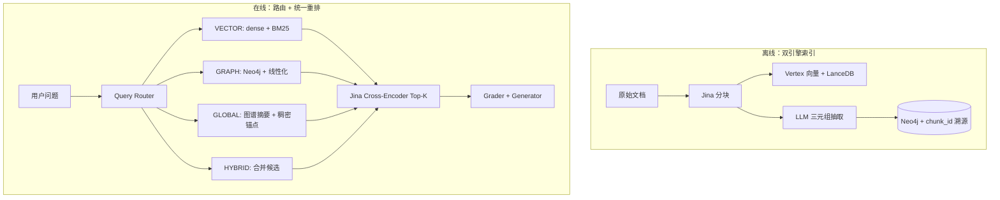

# 🧠 DynaSense-RAG（MAP-RAG 架构）

> **MAP-RAG**: Multi-resolution Agentic Perception Retrieval-Augmented Generation

面向企业场景的 RAG（检索增强生成）架构原型，强调严格的反幻觉机制、智能语义分块与 Cross-Encoder 重排序。

## 🌐 其它语言
[English 🇺🇸](README.md) · [日本語 🇯🇵](README-jp.md) · [Deutsch 🇩🇪](README-de.md) · [繁體中文](README-ch.md)

## 🎯 核心理念
**「没有回答，好过错误／有害的回答。」**

在企业环境（法务、金融、内部人事政策）中，LLM 幻觉不可接受。本 MVP 在主流程上**明确拒绝**实时通用查询改写，以避免「意图漂移」（专业内部术语被改写成泛化用语、失去精确含义），并减少不必要的 LLM 延迟。

取而代之的是通过以下方式获得高精度：
1. **智能分块**（Jina Segmenter）
2. **高维向量检索**（Google Vertex AI `text-embedding-004` + LanceDB）
3. **Cross-Encoder 语义重排序**（Jina Multilingual Reranker）
4. **双轨 Grader + Generator**（LangGraph 状态机 — 事实型查询严格、推理型查询可分析）
5. **服务端多轮记忆**（带上下文长度控制的会话）
6. **Hybrid RAG（MVP）** — **Query Router** + **Dense + BM25** + **Neo4j 图谱召回** + 进入打分前的统一 **Top‑K 重排**（见 `docs/mvp_hybrid_rag.md`）


## 🏗️ 架构设计（MAP-RAG）

```text
╔══════════════════════════════════════════════════════════════════════╗
║                     数据摄取流水线                                     ║
╚══════════════════════════════════════════════════════════════════════╝

原始文档（TXT/MD）
      │
      ▼
[ Jina 语义切分器 ] ──(分块)──> 子文本块
                                              │
                    ┌─────────────────────────┴──────────────────────────┐
                    ▼                                                    ▼
         [ 文档库（MongoMock） ]                    [ Vertex AI Embeddings ]
           存储：完整父文本                            text-embedding-004
           键：parent_id  ◄──── parent_id ────────────────────┤
                                                               ▼
                                                    [ 向量库（LanceDB） ]
                                                      存储：稠密向量
                                                      元数据：parent_id

╔══════════════════════════════════════════════════════════════════════╗
║               检索与生成流水线                                         ║
╚══════════════════════════════════════════════════════════════════════╝

  用户查询 ──────────────────────────────────┐
      │                                         │ （多轮）
      │                              [ 会话记忆 ]
      │                              conversation_id
      │                              历史 → 上下文预算
      │                              _build_query_with_history()
      │                                         │
      ▼                                         ▼
[ LanceDB 向量检索 ]  ←──── 带历史的增强查询
   Top K=10 子块
      │
      ▼
[ Small-to-Big 扩展 ]
   child_id → parent_id → 完整父文本
      │
      ▼
[ Jina Cross-Encoder 重排序 ]
   Top K=3 高精度父文档
      │
      ▼
[ 查询类型检测 ]   ← NEW: _is_analysis_query()
      │
      ├─────── 事实型查询 ──────────────────────────────────┐
      │        （查找、定义、具体事实）                        │
      │                                                        ▼
      │                                           [ GRADE_PROMPT（严格） ]
      │                                           「上下文是否包含
      │                                            可直接回答的事实？」
      │                                                        │
      │                                            否 ──► [ 拦截 / 兜底 ]
      │                                            是 ──► [ GEN_PROMPT ]
      │                                                    「严格使用上下文。」
      │
      └─────── 分析型查询 ────────────────────────────────┐
               （分析/影响/如何/为什么/规划/评估…）         │
               （analyze/impact/why/how/plan/risk…）         ▼
                                                 [ GRADE_ANALYSIS_PROMPT（宽松） ]
                                                 「上下文是否包含**任意**
                                                  与主题相关的背景事实？」
                                                              │
                                                  否 ──► [ 拦截 / 兜底 ]
                                                  是 ──► [ GEN_ANALYSIS_PROMPT ]
                                                          「事实 grounding + 领域推理。
                                                           标注：
                                                           【文档事实】【分析推理】」
                                                              │
                                                              ▼
                                                   最终合成回答
```

系统采用有向 LangGraph 状态机。关键设计决策：
- **关键路径不做查询改写** — 防止意图漂移、降低延迟
- **双轨路由** — 分析型查询不会被「过严的事实型 grader」误杀；模型需显式区分推理与检索事实
- **默认失败即关闭（fail-closed）** — grader 报错时拦截回答，而非放行未验证上下文


## 📊 基准结果（SciQ 数据集）
在 HuggingFace `sciq` 数据集的子集（1000 篇文档、100 个问题）上对本流水线进行评测。

| 指标 | 基础向量检索（Vertex AI） | 流水线（向量 + Jina Reranker） | 提升 |
|---|---|---|---|
| **Recall@1** | 86.0% | **96.0%** | 🚀 **+10.0%** |
| **Recall@3** | 96.0% | **100.0%** | 🚀 **+4.0%** |
| **Recall@5** | 99.0% | **100.0%** | +1.0% |
| **Recall@10** | 100.0% | 100.0% | 已触顶 |

*结论*：重排序器起到高精度「狙击」作用，使 LLM 往往只需处理 1–3 个文本块即可获得正确上下文（本评测中达 100%）。可显著节省 token、降低延迟并缩小幻觉窗口。

### Recall@K / NDCG@K（批量脚本，SciQ）
由 `scripts/benchmark_recall_ndcg.py` 自动跑批，与评测栈一致（`run_evaluation`），**仅向量路径**（`use_hybrid=false`）。最新报告：[`reports/recall_ndcg_benchmark_latest.md`](reports/recall_ndcg_benchmark_latest.md)。

| 设置 | 数值 |
|--------|--------|
| 语料 | HuggingFace `allenai/sciq`（train），每条唯一 `support` 段落作为父文档 |
| 入库文档数 | 60 |
| 评测问题数 | 30 |
| 检索模式 | Dense → Small-to-Big → Jina 重排（关闭 hybrid 路由） |

| 指标（均值） | 数值 |
|---------------|-------|
| Recall@1,3,5,10 | 1.000 |
| NDCG@1,3,5,10 | 1.000 |

原始 JSON 与时间戳报告见 `reports/recall_ndcg_benchmark_*.{json,md}`。详见 [`docs/recall_evaluation.md`](docs/recall_evaluation.md)。

## ✨ 功能亮点

### 双轨查询路由（分析 vs 事实）
流水线自动判断查询需要**事实检索**还是**分析推理**，并路由到对应的 grader 与生成策略：

| | 事实轨 | 分析轨 |
|---|---|---|
| **触发** | 默认 | 关键词：分析/影响/如何/规划/evaluate/impact… |
| **Grader** | 严格：上下文须含直接可答事实 | 宽松：仅需任意主题相关事实 |
| **Generator** | `GEN_PROMPT`：「严格使用上下文」 | `GEN_ANALYSIS_PROMPT`：事实 + 领域推理 |
| **输出格式** | 直接回答 | `【文档事实】` + `【分析推理】` 分段标注 |

**演示 — 部分上下文下的分析查询：**
> **用户**：介绍「豌豆苗期货」，分析天气对该期货交易的影响
>
> **检索到的上下文**：生长周期 3 个月，地区：东海岸农场，产量 10 吨/日
>
> **回复**（节选）：
> **【文档事实】** 豌豆苗期货作物生长周期 3 个月，日产量 10 吨。
> **【分析推理】** 基于行业经验：① 极端天气（霜冻/高温）可直接导致减产并推高期货价格；② 高温高湿易诱发病虫害，降低可交割品质；③ 恶劣天气阻碍运输，增加物流成本并传导至期货端。

完整设计、实现细节与 4 个演示案例见 [docs/dual-track-query-routing.md](./docs/dual-track-query-routing.md)。

### 服务端多轮记忆
后端通过 `conversation_id` 管理会话，含上下文长度控制与 TTL 清理。详见 [docs/chat_test_memory_design.md](./docs/chat_test_memory_design.md)。

### A/B 记忆策略对比
`POST /api/chat/session/ab` 对同一条消息并行运行 `prioritized` 与 `legacy` 两种记忆模式，并排返回查询内容、回答与拦截状态，便于快速诊断记忆策略效果。

### Hybrid RAG — 路由 + 双路召回 + Neo4j（MVP）
实现 **`readme-v2-1.md`**：LLM **意图路由**（`VECTOR` / `GRAPH` / `GLOBAL` / `HYBRID`）、**双引擎索引**（LanceDB + 带 `chunk_id` 溯源的 Neo4j 三元组）、在线 **Dense + BM25** 与 **图谱线性化** 召回，并在既有 grader/generator 前做 **单次 Jina 重排** 截断为 Top‑5。

```text
用户 Query
    │
    ▼
[ Query Router (LLM) ] ──► VECTOR | GRAPH | GLOBAL | HYBRID
    │
    ├─ VECTOR ──► Dense(Small-to-Big) + BM25(子→父) ──┐
    ├─ GRAPH ───► Neo4j 子图 → 线性化三元组文本 ─────┤──► [ Jina Rerank Top‑5 ]
    ├─ GLOBAL ──► 图谱摘要 + 小体量稠密锚点 ─────────┤
    └─ HYBRID ──► 合并 VECTOR + GRAPH 候选 ─────────┘
                                        │
                                        ▼
                           Grader（反幻觉）→ Generator
```



- **本地 Neo4j**：`docker compose -f docker-compose.neo4j.yml up -d`（Bolt `7687`，默认密码 `changeme`）。
- **演示语料**：上传 `data/demo_related_party.txt`，可问 *「中国中信银行的关联方有哪些？」* — 日志中常见 `GRAPH` 或 `HYBRID` 且带图谱上下文。
- **关闭 Hybrid**（回退纯向量 LangGraph）：`export HYBRID_RAG_ENABLED=false`。

完整说明见 [`docs/mvp_hybrid_rag.md`](docs/mvp_hybrid_rag.md)。

---

## 🛠️ 技术栈
* **编排**：`LangGraph` & `LangChain`
* **嵌入模型**：Google Vertex AI `text-embedding-004`
* **LLM**：Google Vertex AI `gemini-2.5-pro`
* **向量数据库**：`LanceDB`
* **语义分块**：`Jina Segmenter API`
* **重排序**：`jina-reranker-v2-base-multilingual`
* **图数据库（Hybrid MVP）**：Neo4j Community（本地 Docker）+ `neo4j` Python 驱动
* **词法检索**：`rank-bm25`（子块 BM25Okapi）
* **会话存储**：带 TTL 的内存 `dict`（可升级为 Redis）

## 🚀 快速开始
```bash
# 1. 创建虚拟环境
python3 -m venv .venv
source .venv/bin/activate

# 2. 安装依赖
pip install langchain langchain-google-vertexai langgraph lancedb==0.5.2 pydantic bs4 pandas numpy jina requests mongomock datasets polars

# 3. 配置 API 密钥与 GCP
export GOOGLE_CLOUD_PROJECT="your-project-id"
export GOOGLE_APPLICATION_CREDENTIALS="/path/to/your/gcp-sa.json"
export JINA_API_KEY="your-jina-api-key"

# 4.（可选）本地 Neo4j，用于 Hybrid RAG
docker compose -f docker-compose.neo4j.yml up -d
export NEO4J_PASSWORD="changeme"   # 须与 compose 中一致

# 5. 启动 Web 服务
.venv/bin/uvicorn src.app:app --host 0.0.0.0 --port 8000

# 浏览器打开 http://localhost:8000
# 标签 1：上传文档
# 标签 2：单轮对话
# 标签 3：评测
# 标签 4：多轮对话测试（记忆 + A/B 对比）
```

## 📄 文档

| 文档 | 说明 |
|---|---|
| [docs/langsmith_observability.md](./docs/langsmith_observability.md) | **LangSmith 可观测性** — 环境变量、初始化顺序（`src/observability.py`），[官方文档](https://docs.langchain.com/langsmith/observability) |
| [docs/langgraph_stream_log.md](./docs/langgraph_stream_log.md) | **LangGraph 流式日志** — `LANGGRAPH_STREAM_LOG`、`invoke_rag_app` 中 `stream_mode="values"` |
| [docs/mvp_hybrid_rag.md](./docs/mvp_hybrid_rag.md) | **Hybrid RAG MVP** — 路由、Dense+BM25、Neo4j、融合重排（`readme-v2-1.md`） |
| [docs/recall_evaluation.md](./docs/recall_evaluation.md) | **Recall@K / NDCG@K** — 用例、批量 API、`scripts/run_recall_eval.py` |
| [docs/recall_ndcg_benchmark_plan.md](./docs/recall_ndcg_benchmark_plan.md) | **SciQ 基准方案** — `scripts/benchmark_recall_ndcg.py`，报告 `reports/recall_ndcg_benchmark_*.md` |
| [docs/dual-track-query-routing.md](./docs/dual-track-query-routing.md) | **双轨查询路由** — 分析与事实、grader/生成策略、演示问答 |
| [docs/chat_test_memory_design.md](./docs/chat_test_memory_design.md) | 服务端多轮记忆、`conversation_id` 会话设计 |
| [docs/doc-small-to-big-retrieval.md](./docs/doc-small-to-big-retrieval.md) | 父子块扩展（Small-to-Big 检索） |
| [docs/doc-feauture-v1.md](./docs/doc-feauture-v1.md) | 初始架构 RFC |
| [docs/doc-future.md](./docs/doc-future.md) | 企业侧防止劣质回答的原则 |
| [readme-v2-1.md](./readme-v2-1.md) | 双轨 Hybrid RAG 产品说明与 **Q&A 测试数据**（含关联交易演示链接与示例问法） |
