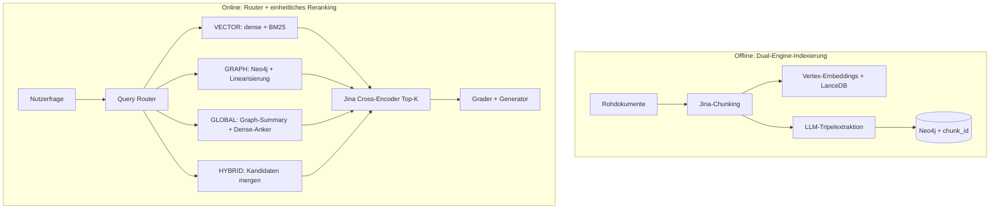

# 🧠 DynaSense-RAG (MAP-RAG-Architektur)

> **MAP-RAG**: Multi-resolution Agentic Perception Retrieval-Augmented Generation

Ein prototypische RAG-Architektur (Retrieval-Augmented Generation) auf Unternehmensniveau mit Fokus auf strikte Anti-Halluzinations-Mechanismen, intelligente semantische Chunking und Cross-Encoder-Reranking.

## 🌐 Weitere Sprachen
[English 🇺🇸](README.md) · [日本語 🇯🇵](README-jp.md) · [简体中文](README-cn.md) · [繁體中文](README-ch.md)

## 🎯 Kernphilosophie
**„Keine Antwort ist besser als eine schlechte/toxische Antwort.“**

In Unternehmensumgebungen (Recht, Finanzen, interne HR-Richtlinien) sind LLM-Halluzinationen inakzeptabel. Dieses MVP **verzichtet** bewusst auf Echtzeit-Query-Rewriting im Hauptpfad, um „Intent Drift“ zu vermeiden (Fachbegriffe werden in Allgemeinbegriffe umgeschrieben und verlieren ihre exakte Bedeutung) und unnötige LLM-Latenz zu sparen.

Stattdessen wird hohe Präzision erreicht durch:
1. **Intelligentes Chunking** (Jina Segmenter)
2. **Hochdimensionale Vektor-Suche** (Google Vertex AI `text-embedding-004` + LanceDB)
3. **Cross-Encoder-Semantik-Reranking** (Jina Multilingual Reranker)
4. **Zwei-Spur-Grader + Generator** (LangGraph-Zustandsautomat — strikt bei Faktenfragen, analytisch bei Begründungsfragen)
5. **Serverseitiger Multi-Turn-Speicher** (Konversationssitzung mit Kontextlängen-Steuerung)
6. **Hybrid RAG (MVP)** — **Query Router** + **Dense + BM25** + **Neo4j-Graph-Recall** + einheitliches **Top‑K-Reranking** vor dem Grading (siehe `docs/mvp_hybrid_rag.md`)


## 🏗️ Architekturentwurf (MAP-RAG)

```text
╔══════════════════════════════════════════════════════════════════════╗
║                     DATEN-INGESTION-PIPELINE                          ║
╚══════════════════════════════════════════════════════════════════════╝

Rohdokumente (TXT/MD)
      │
      ▼
[ Jina Semantic Segmenter ] ──(Chunking)──> Kind-Text-Chunks
                                              │
                    ┌─────────────────────────┴──────────────────────────┐
                    ▼                                                    ▼
         [ Document DB (MongoMock) ]                    [ Vertex AI Embeddings ]
           Speichert: vollständiger Elterntext          text-embedding-004
           Schlüssel: parent_id  ◄──── parent_id ────────────────────┤
                                                               ▼
                                                    [ Vector DB (LanceDB) ]
                                                      Speichert: dichte Vektoren
                                                      Metadaten: parent_id

╔══════════════════════════════════════════════════════════════════════╗
║               RETRIEVAL- & GENERIERUNGS-PIPELINE                    ║
╚══════════════════════════════════════════════════════════════════════╝

  Nutzeranfrage ──────────────────────────────────┐
      │                                         │ (Multi-Turn)
      │                              [ Session Memory ]
      │                              conversation_id
      │                              Verlauf → Kontextbudget
      │                              _build_query_with_history()
      │                                         │
      ▼                                         ▼
[ LanceDB Vector Search ]  ←──── angereicherte Anfrage (mit Verlauf)
   Top K=10 Kind-Chunks
      │
      ▼
[ Small-to-Big Expansion ]
   child_id → parent_id → vollständiger Elterntext
      │
      ▼
[ Jina Cross-Encoder Reranker ]
   Top K=3 hochpräzise Elterndokumente
      │
      ▼
[ Abfragetyp-Erkennung ]   ← NEU: _is_analysis_query()
      │
      ├─────── Faktenabfrage ──────────────────────────────────┐
      │        (Nachschlagen, Definition, konkrete Fakten)    │
      │                                                        ▼
      │                                           [ GRADE_PROMPT (strikt) ]
      │                                           „Enthält der Kontext
      │                                            eine direkte Antwort?“
      │                                                        │
      │                                            NEIN ──► [ Block / Fallback ]
      │                                            JA ──► [ GEN_PROMPT ]
      │                                                    „Kontext strikt nutzen.“
      │
      └─────── Analyseabfrage ────────────────────────────────┐
               (分析/影响/如何/规划/评估… / analyze/impact/why/how/plan/risk…) ▼
                                                 [ GRADE_ANALYSIS_PROMPT (locker) ]
                                                 „Enthält der Kontext IRGENDEIN
                                                  themenbezogenes Hintergrundfaktum?“
                                                              │
                                                  NEIN ──► [ Block / Fallback ]
                                                  JA ──► [ GEN_ANALYSIS_PROMPT ]
                                                          „Fakten gründen + Domänen-
                                                           schlussfolgerung. Labels:
                                                           【文档事实】【分析推理】.“
                                                              │
                                                              ▼
                                                   Finale synthetisierte Antwort
```

Das System nutzt einen gerichteten LangGraph-Zustandsautomaten. Wichtige Designentscheidungen:
- **Kein Query Rewrite im kritischen Pfad** — verhindert Intent Drift, reduziert Latenz
- **Zwei-Spur-Routing** — Analyseabfragen werden nicht durch einen strikten Fakten-Grader blockiert; das LLM soll Schlussfolgerungen vs. abgerufene Fakten kennzeichnen
- **Standardmäßig Fail-Closed** — bei Grader-Fehler blockiert die Pipeline die Antwort statt ungeprüften Kontext durchzureichen


## 📊 Benchmark-Ergebnisse (SciQ-Datensatz)
Die Pipeline wurde gegen eine Teilmenge des HuggingFace-`sciq`-Datensatzes (1000 Dokumente, 100 Fragen) gemessen.

| Metrik | Basis-Vektorsuche (Vertex AI) | Pipeline (Vektor + Jina Reranker) | Verbesserung |
|---|---|---|---|
| **Recall@1** | 86,0% | **96,0%** | 🚀 **+10,0%** |
| **Recall@3** | 96,0% | **100,0%** | 🚀 **+4,0%** |
| **Recall@5** | 99,0% | **100,0%** | +1,0% |
| **Recall@10** | 100,0% | 100,0% | Maximum |

*Fazit*: Der Reranker wirkt wie ein Präzisions-„Scharfschütze“: Das LLM benötigt oft nur 1–3 Text-Chunks für den richtigen Kontext (100 % in diesem Benchmark). Das spart Tokenkosten, senkt Latenz und verringert Halluzinationsrisiken.

### Recall@K / NDCG@K (Batch-Skript, SciQ)
Automatischer Lauf mit `scripts/benchmark_recall_ndcg.py` — gleicher Retrieval-Stack wie die Evaluation (`run_evaluation`), **nur Vektorpfad** (`use_hybrid=false`). Aktueller Bericht: [`reports/recall_ndcg_benchmark_latest.md`](reports/recall_ndcg_benchmark_latest.md).

| Einstellung | Wert |
|--------|--------|
| Korpus | HuggingFace `allenai/sciq` (train), je ein `support`-Absatz als Parent |
| Indexierte Dokumente | 60 |
| Evaluations-Queries | 30 |
| Retrieval-Modus | Dense → Small-to-Big → Jina-Rerank (Hybrid-Routing aus) |

| Metrik (Mittelwert) | Wert |
|---------------|-------|
| Recall@1,3,5,10 | 1.000 |
| NDCG@1,3,5,10 | 1.000 |

Roh-JSON und zeitgestempelte Reports unter `reports/recall_ndcg_benchmark_*.{json,md}`. Details: [`docs/recall_evaluation.md`](docs/recall_evaluation.md).

## ✨ Funktionshighlights

### Zwei-Spur-Abfrage-Routing (Analyse vs. Fakten)
Die Pipeline erkennt automatisch, ob eine **Faktenabfrage** oder **analytische Begründung** nötig ist, und leitet an den passenden Grader und Generator weiter:

| | Fakten-Spur | Analyse-Spur |
|---|---|---|
| **Auslöser** | Standard | Schlüsselwörter: 分析/影响/如何/规划/evaluate/impact… |
| **Grader** | Strikt: direkte Antwort im Kontext nötig | Locker: jedes themenbezogene Faktum reicht |
| **Generator** | `GEN_PROMPT`: „Kontext strikt nutzen“ | `GEN_ANALYSIS_PROMPT`: Fakten + Domänen-Reasoning |
| **Ausgabeformat** | Direkte Antwort | Abschnitte mit `【文档事实】` + `【分析推理】` |

**Demo — Analyseabfrage bei teilweisem Kontext:**
> **Nutzer**: Stelle „豌豆苗期货“ vor und analysiere den Einfluss des Wetters auf diesen Terminhandel.
>
> **Abgerufener Kontext**: Wachstumszyklus 3 Monate, Region: Ostküsten-Farmen, Ertrag 10 t/Tag
>
> **Antwort** *(gekürzt)*:
> **【文档事实】** … Wachstumszyklus 3 Monate, Tagesertrag 10 t.
> **【分析推理】** … Branchenerfahrung: extremes Wetter kann Ernten mindern und Preise treiben; Feuchtigkeit begünstigt Schädlinge; schlechtes Wetter behindert Transport und Logistikkosten.

Vollständige Beschreibung, Implementierung und 4 Demos: [docs/dual-track-query-routing.md](./docs/dual-track-query-routing.md).

### Serverseitiger Multi-Turn-Speicher
Konversationssitzungen per `conversation_id` auf dem Backend, mit Kontextlängen-Steuerung und TTL-Bereinigung. Siehe [docs/chat_test_memory_design.md](./docs/chat_test_memory_design.md).

### A/B-Vergleich der Speicherstrategie
`POST /api/chat/session/ab` führt für dieselbe Nachricht `prioritized` und `legacy` parallel aus und liefert Abfrage, Antworten und Blockstatus nebeneinander — für schnelle Diagnose der Speicherstrategie.

### Hybrid RAG — Routing + Dual Recall + Neo4j (MVP)
Umsetzung von **`readme-v2-1.md`**: LLM-**Intent-Router** (`VECTOR` / `GRAPH` / `GLOBAL` / `HYBRID`), **Dual-Indexing** (LanceDB + Neo4j-Tripel mit `chunk_id`-Provenienz), Online-**Dense + BM25** und **Graph-Linearisierung**, **ein** Jina-Rerank auf Top‑5 vor Grader/Generator.

```text
Nutzeranfrage
    │
    ▼
[ Query Router (LLM) ] ──► VECTOR | GRAPH | GLOBAL | HYBRID
    │
    ├─ VECTOR ──► Dense(Small-to-Big) + BM25(Kind→Parent) ──┐
    ├─ GRAPH ───► Neo4j-Teilgraph → linearisierte Tripel ────┤──► [ Jina Rerank Top‑5 ]
    ├─ GLOBAL ──► Graph-Zusammenfassung + kleiner Dense-Anker ┤
    └─ HYBRID ──► Merge VECTOR + GRAPH ─────────────────────┘
                                        │
                                        ▼
                           Grader (Anti-Halluzination) → Generator
```



- **Lokales Neo4j**: `docker compose -f docker-compose.neo4j.yml up -d` (Bolt `7687`, Standardpasswort `changeme`).
- **Demo-Korpus**: `data/demo_related_party.txt` hochladen, z. B. *「中国中信银行的关联方有哪些？」* — in den Logs typischerweise `GRAPH` oder `HYBRID` mit Graph-Kontext.
- **Hybrid deaktivieren** (Legacy nur Vektor): `export HYBRID_RAG_ENABLED=false`.

Vollständige Beschreibung: [`docs/mvp_hybrid_rag.md`](docs/mvp_hybrid_rag.md).

---

## 🛠️ Tech-Stack
* **Orchestrierung**: `LangGraph` & `LangChain`
* **Embedding-Modell**: Google Vertex AI `text-embedding-004`
* **LLM**: Google Vertex AI `gemini-2.5-pro`
* **Vektor-Datenbank**: `LanceDB`
* **Semantisches Chunking**: `Jina Segmenter API`
* **Reranker**: `jina-reranker-v2-base-multilingual`
* **Graph-DB (Hybrid MVP)**: Neo4j Community (lokal per Docker) + Python-Treiber `neo4j`
* **Lexikalische Suche**: `rank-bm25` (BM25Okapi über Kind-Chunks)
* **Session-Speicher**: In-Memory-`dict` mit TTL (erweiterbar mit Redis)

## 🚀 Erste Schritte
```bash
# 1. Virtuelle Umgebung einrichten
python3 -m venv .venv
source .venv/bin/activate

# 2. Abhängigkeiten installieren
pip install langchain langchain-google-vertexai langgraph lancedb==0.5.2 pydantic bs4 pandas numpy jina requests mongomock datasets polars

# 3. API-Schlüssel und GCP-Konfiguration
export GOOGLE_CLOUD_PROJECT="your-project-id"
export GOOGLE_APPLICATION_CREDENTIALS="/path/to/your/gcp-sa.json"
export JINA_API_KEY="your-jina-api-key"

# 4. (Optional) Lokales Neo4j für Hybrid RAG
docker compose -f docker-compose.neo4j.yml up -d
export NEO4J_PASSWORD="changeme"   # wie in der Compose-Datei

# 5. Webserver starten
.venv/bin/uvicorn src.app:app --host 0.0.0.0 --port 8000

# Im Browser http://localhost:8000 öffnen
# Tab 1: Dokumente hochladen
# Tab 2: Einzelrunden-Chat
# Tab 3: Evaluation
# Tab 4: Multi-Turn-Chat-Test (mit Speicher + A/B-Vergleich)
```

## 📄 Dokumentation

| Dokument | Beschreibung |
|---|---|
| [docs/langsmith_observability.md](./docs/langsmith_observability.md) | **LangSmith Observability** — Umgebungsvariablen, Init-Reihenfolge (`src/observability.py`), [offizielle Docs](https://docs.langchain.com/langsmith/observability) |
| [docs/langgraph_stream_log.md](./docs/langgraph_stream_log.md) | **LangGraph Stream-Logs** — `LANGGRAPH_STREAM_LOG`, `invoke_rag_app` |
| [docs/architecture.md](./docs/architecture.md) | **Clean Architecture** — Layering `api/`, `core/`, `domain/`, `infrastructure/` |
| [docs/mvp_hybrid_rag.md](./docs/mvp_hybrid_rag.md) | **Hybrid-RAG-MVP** — Router, Dense+BM25, Neo4j, Fusion-Rerank (`readme-v2-1.md`) |
| [docs/recall_evaluation.md](./docs/recall_evaluation.md) | **Recall@K / NDCG@K** — Fälle, Batch-API, `scripts/run_recall_eval.py` |
| [docs/recall_ndcg_benchmark_plan.md](./docs/recall_ndcg_benchmark_plan.md) | **SciQ-Benchmark-Plan** — `scripts/benchmark_recall_ndcg.py`, Reports `reports/recall_ndcg_benchmark_*.md` |
| [docs/dual-track-query-routing.md](./docs/dual-track-query-routing.md) | **Zwei-Spur-Routing** — Analyse vs. Fakten, Grader/Generator, Demo-Q&A |
| [docs/chat_test_memory_design.md](./docs/chat_test_memory_design.md) | Serverseitiger Multi-Turn-Speicher, `conversation_id`-Design |
| [docs/doc-small-to-big-retrieval.md](./docs/doc-small-to-big-retrieval.md) | Eltern-Kind-Chunk-Expansion (Small-to-Big) |
| [docs/doc-feauture-v1.md](./docs/doc-feauture-v1.md) | Initiale Architektur-RFC |
| [docs/doc-future.md](./docs/doc-future.md) | Unternehmensprinzipien gegen schlechte Antworten |
| [readme-v2-1.md](./readme-v2-1.md) | Produkt-Spezifikation Dual-Track Hybrid RAG + **Q&A-Testdaten** (Demo-Link Verbundparteien) |
