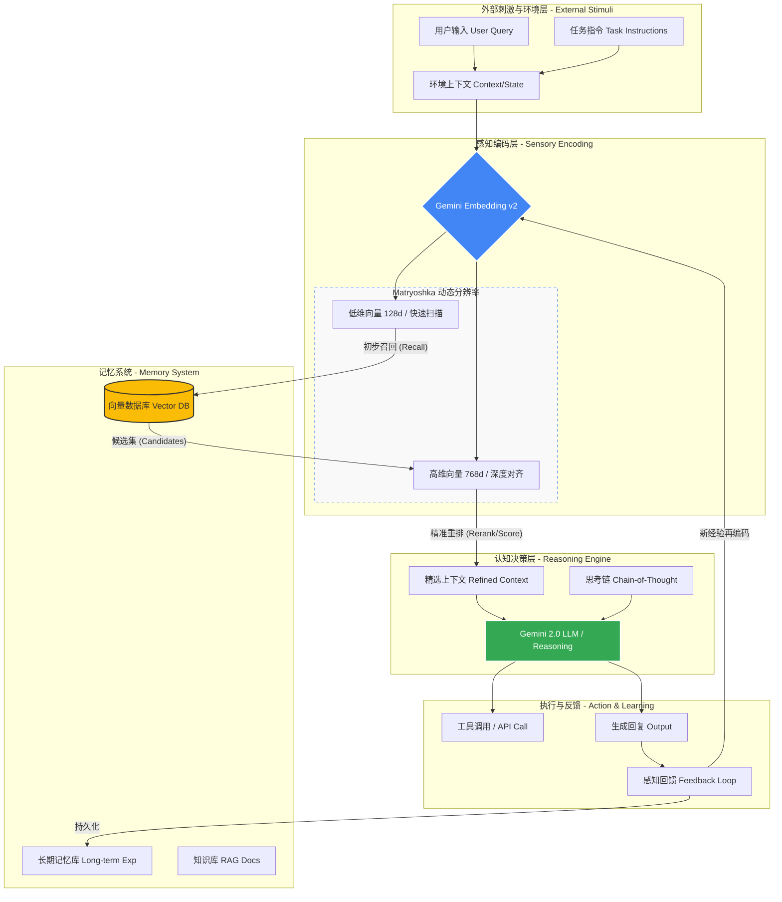

# 重新定义 Agent RAG：基于 Gemini Embedding v2 的多分辨率感知-认知闭环架构 (MAP-RAG)

> **作者：** AI 架构师/资深工程师研讨记录
> **核心标签：** #AgenticRAG #Gemini #LangGraph #Matryoshka #架构设计

Google 发布 Gemini Embedding v2，不仅是参数规模或榜单得分（MTEB）的提升，更代表了 Embedding 模型从“单纯的向量工具”向“Agent 核心认知组件”演进的重要节点。本文将从底层技术解析、架构范式转移到最终的 LangGraph 工程落地，带你全面解析这套被称为 **MAP-RAG (多分辨率自适应感知 RAG)** 的前沿架构。

---

## 一、 技术底层密码：Gemini Embedding v2 的核心突破

Gemini v2 之所以能改变 RAG 的架构玩法，源于其底层的三大突破：

1. **Matryoshka 表征学习 (MRL - 俄罗斯套娃架构)**
   * **原理**：模型在训练时被强制要求将最重要的语义信息压缩在前几个维度中。
   * **工程意义**：允许开发者动态截断向量维度（如从 768 维降至 128 维），在节省 80% 存储成本的同时，保留 90% 以上的检索精度，完美解决超大规模 RAG 的延迟（Latency）痛点。
2. **Task-Aware 意图感知 (指令微调)**
   * 彻底改变了传统 Embedding 对“指令”和“内容”不敏感的问题。它能区分什么是“事实检索”，什么是“逻辑关联”，在向量化阶段就完成意图的偏移。
3. **高密度语义同源**
   * 底层基于 Gemini 2.0 骨干网络蒸馏而来。向量分布与大模型 (LLM) 的内部注意力机制高度一致，极大降低了由于“找回字面相关但语义无关”片段而导致的**模型幻觉 (Hallucination)**。

---

## 二、 范式转移：从“检索工具链”到“Agent 感知层”

在传统的 RAG 中，`(用户 Input + Embed + 向量存储/检索)` 只是一套冷冰冰的**物理工具链**。但在 Agent 架构中，由于 Gemini v2 的特性，它被升华为了 Agent 的**“感知层 (Perception Layer)”**。

我们可以用人类感官系统做类比：
* **用户 Input (外部刺激)**：包含显性需求、隐性情绪和环境上下文。
* **Embedding (神经编码)**：将刺激转化为大脑（LLM）能理解的特征向量。利用 MRL 架构，Agent 可以像人眼一样调整“焦距”——128 维进行快速余光扫描，768 维进行深度聚焦凝视。
* **向量检索 (海马体记忆提取)**：利用高密度的语义空间，从海量长期记忆中瞬间联想到最精准的片段。

---

## 三、 MAP-RAG 核心架构图设计

基于上述理念，我们设计了 **MAP-RAG (Multiresolution Adaptive Perceptual RAG)** 架构。它超越了传统“Query -> Search -> LLM”的线性模式，转而采用**“感知-认知-记忆”的闭环状态机**。



---

## 四、 工程落地：基于 LangGraph 的 Python 实现

我们将这套“多分辨率感知”与“Agent 反思闭环”在 LangChain / LangGraph 框架中进行落地。核心亮点在于 **任务隔离 (Task Type)**、**维度自适应 (MRL降维)** 和 **认知评估路由**。

### 1. 核心依赖
```bash
pip install -U langchain langchain-google-genai langgraph faiss-cpu pydantic
export GOOGLE_API_KEY="your-gemini-api-key"
```

### 2. 完整实现代码
```python
from langchain_google_genai import ChatGoogleGenerativeAI, GoogleGenerativeAIEmbeddings
from langchain_community.vectorstores import FAISS
from langchain_core.documents import Document
from langchain_core.prompts import ChatPromptTemplate
from langgraph.graph import END, StateGraph, START
from typing import List
from typing_extensions import TypedDict
from pydantic import BaseModel, Field

# ==========================================
# 1. 感知层配置 (Gemini Embedding v2 核心特性落地)
# ==========================================
# [亮点 A]: 利用 output_dimensionality 模拟 MRL 低维存储（强制降维到 256 节省内存）
# [亮点 B]: 利用 task_type 区分“存入文档”和“实时查询”的意图空间

doc_embeddings = GoogleGenerativeAIEmbeddings(
    model="models/text-embedding-004", 
    task_type="RETRIEVAL_DOCUMENT",
    output_dimensionality=256  
)

query_embeddings = GoogleGenerativeAIEmbeddings(
    model="models/text-embedding-004",
    task_type="RETRIEVAL_QUERY", 
    output_dimensionality=256
)

# 初始化知识库
sample_docs =[
    Document(page_content="公司 2023 年 Q3 营收为 500 万美元，主要得益于 AI 产品的订阅增长。"),
    Document(page_content="2024 年战略规划：全面投入 Agentic 架构研发。")
]
vectorstore = FAISS.from_documents(sample_docs, doc_embeddings)
retriever = vectorstore.as_retriever(search_kwargs={"k": 2})

# ==========================================
# 2. 认知层配置 (状态定义与 LLM 大脑)
# ==========================================
llm = ChatGoogleGenerativeAI(model="gemini-1.5-pro", temperature=0)

class AgentState(TypedDict):
    question: str
    documents: List[str]
    generation: str
    loop_count: int

class GradeDocuments(BaseModel):
    binary_score: str = Field(description="文档是否与问题相关？回答 'yes' 或 'no'")
grader_llm = llm.with_structured_output(GradeDocuments)

# ==========================================
# 3. 闭环节点定义 (Nodes)
# ==========================================
def retrieve_node(state: AgentState):
    print("--- [感知层] 执行向量检索 ---")
    docs = retriever.invoke(state["question"]) 
    return {"documents":[doc.page_content for doc in docs]}

def grade_documents_node(state: AgentState):
    print("---[认知层] 评估感知质量 (防幻觉) ---")
    filtered_docs =[]
    grade_prompt = ChatPromptTemplate.from_messages([
        ("system", "判断给定的文档是否包含解答问题的关键信息。"),
        ("human", "问题: {question}\n\n文档: {document}")
    ])
    for doc in state["documents"]:
        result = (grade_prompt | grader_llm).invoke({"question": state["question"], "document": doc})
        if result.binary_score == "yes":
            filtered_docs.append(doc)
    return {"documents": filtered_docs}

def rewrite_query_node(state: AgentState):
    print("--- [执行层] 检索失败，触发经验闭环，重写 Query ---")
    rewrite_prompt = ChatPromptTemplate.from_messages([
        ("system", "意图优化专家：请根据原问题，换一种表达方式或提取核心关键词。"),
        ("human", "原问题: {question}")
    ])
    new_question = (rewrite_prompt | llm).invoke({"question": state["question"]}).content
    return {"question": new_question, "loop_count": state.get("loop_count", 0) + 1}

def generate_node(state: AgentState):
    print("--- [执行层] 结合精选记忆生成回答 ---")
    gen_prompt = ChatPromptTemplate.from_messages([
        ("system", "使用以下检索到的上下文来回答问题。\n上下文: {context}"),
        ("human", "问题: {question}")
    ])
    generation = (gen_prompt | llm).invoke({"context": "\n".join(state["documents"]), "question": state["question"]}).content
    return {"generation": generation}

# ==========================================
# 4. 图谱编排与条件路由 (Graph Routing)
# ==========================================
def decide_to_generate(state: AgentState):
    if len(state["documents"]) > 0 or state.get("loop_count", 0) >= 2:
        return "generate"
    return "rewrite"

workflow = StateGraph(AgentState)
workflow.add_node("retrieve", retrieve_node)
workflow.add_node("grade", grade_documents_node)
workflow.add_node("rewrite", rewrite_query_node)
workflow.add_node("generate", generate_node)

workflow.add_edge(START, "retrieve")
workflow.add_edge("retrieve", "grade")
workflow.add_conditional_edges("grade", decide_to_generate, {"generate": "generate", "rewrite": "rewrite"})
workflow.add_edge("rewrite", "retrieve")
workflow.add_edge("generate", END)

app = workflow.compile()

# ==========================================
# 5. 运行测试
# ==========================================
if __name__ == "__main__":
    print("\n========== 测试：模糊查询触发反思闭环 ==========")
    inputs = {"question": "咱们公司未来打算搞什么技术？", "loop_count": 0}
    for output in app.stream(inputs):
        pass
    print(f"\n最终回答: {output['generate']['generation']}")
```

---

## 五、 架构命名建议：如何定义新一代的系统？

针对这套体系，我们提供三种视角的架构命名方案供不同场景使用：

1. **工程与学术派：MAP-RAG (Multiresolution Adaptive Perceptual RAG)**
   * **中文**：多分辨率自适应感知 RAG 架构。
   * **核心**：直击 MRL 动态降维与自适应任务意图的底层黑科技，适合严谨的技术专利与 PRD 撰写。
2. **认知仿生派：APCL (Adaptive Perception-Cognition Loop)**
   * **中文**：自适应感知-认知闭环架构。
   * **核心**：跳出检索 (Retrieval) 概念，强调大模型的“认知”与向量模型的“感知”循环，极具前瞻性和商业宣发价值。
3. **极简产品派：DynaSense Agentic RAG**
   * **中文**：动态感知智能体 RAG。
   * **核心**：好记、响亮。适合作为开源脚手架 (Boilerplate) 的项目名称。

**结语**：这套组合不再是冷冰冰的“搜索插件”，而是 Agent 感知数字世界、构建长期记忆、并与环境进行动态语义对齐的底层器官。掌控它，即掌控了下一代智能体的基石。

